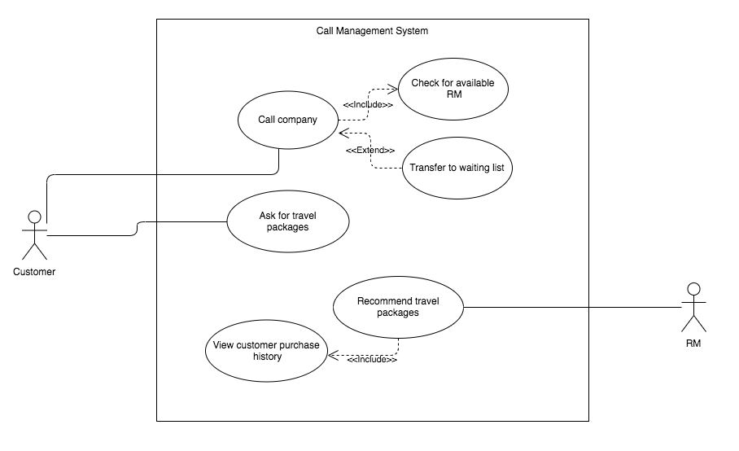

# Title
# Contents
# Acknowledgements
# Executive Summary
Summary of report contents. Should be written after the rest of the report.

# Problem Definition
The business has experienced an increasing number of customer complaints related to their experiences with the relationship manager (RM). Customers often described the RM as unknowledgeable about their desired travel package, and sometimes expressed disinterest in the product they were being sold.

# Business Objectives
* Speed Up Responses and Reduce Abandons; fast response times and low abandon rates.
* Boost Customer Satisfaction
* Increase the Effectiveness of the Service Recovery Programmes
* Improve Forecast Accuracy; ensure customers don’t have to wait for an answer, getting the numbers right is essential
* Minimise inbound call costs by reducing per-call handling time
* Reduce customer wait times
* The system effectively matches customer with an RM.
* Reduce Customer Effort

An investigation into the source of customer complaints revealed the following issues:
* RMs were sometimes unable to cope with the large number of travel packages available for purchase
* RMs were sometimes unable to cope with the number of customers being transferred to them; customer put on hold
* RMs were sometimes unable to sell products to customers due to cultural differences
* RMs were sometimes unable to communicate with customers due to language barriers
* RMs were sometimes conducting random sales pitches to many customers in order to meet sales numbers

The business aims to resolve these issues using an IT solution, with the goal being an improved customer experience.

# Stakeholders
## Stakeholder Table

## Empathy Maps
### Branch Manager

### Relationship Manager (Sales Representative)

### Customer

## Point of View (POV) Statements 
### Customer 
The customer needs to talk to the appropriate person over the phone to fulfil their needs as their needs will be filled by a RM whose speciality department matches their needs.

### Relationship Manager
The relationship manager needs to receive calls from customers that match their specialities, because they will be able to help customers better as they are familiar with the specific area.

### Branch Manager
The branch manager needs to increase customer retention by improving customer experience through the process of assigning calls to RMs which are more suited to their skillset. 

## HMW questions 
### Customer 
* HMW connect to the correct department when calling?
* HMW know the RM we are matched to matches our needs?

### Relationship manager 
*	HMW receive the calls specifically that match our speciality?
*	HMW make this easier for us ?

### Branch manager 
*	HMW ensure the customers are satisfied with the service received?
*	HMW ensure customers receive the right packages?

## Point of View (POV) Statements 
### Customer 
The customer needs to talk to the appropriate person over the phone to fulfil their needs  as their needs will be filled by a RM whose speciality department matches their needs.

### Relationship Manager
The relationship manager needs to receive calls from customers that match their specialities, because they will be able to help customers better as they are familiar with the specific area.

### Branch Manager
The branch manager needs to increase customer retention by improving customer experience through the process of assigning calls to RMs which are more suited to their skillset. 

# Design Approach
Describe the AGILE approach (Scrum) used in this project and explain why it was chosen. Outline the Scrum activities used during this project.

# Assumptions
## Current
* Customers are complaining about poor experiences when purchasing travel packages
* Customers are complaining about poor experiences when being sold travel packages
* CMC employees receive calls
* CMC employees transfer customers to RMs
* CMC employees transfer customers to some RMs more than others
* RMs sometimes conduct random sales pitches to many customers in order to meet sales numbers
* Customers are waiting for more than a certain period to get answered by an RM just hang up

## System
* Customers create unique profiles according to CMC employee instructions before being transferred to RMs
* CMC employees receive calls when automatic routing is unavailable
* CMC employees receive calls when automatic routing fails to find a suitable RM
* The scripts used for sales pitches are created by the business and stored in a fixed location for the system to access
* Calls that are not answered by RM for a specific package are routed to an automated voicemail system
* Calls received are sorted based on whether customer is an ongoing client or a new Potential client
* A supporting tool to create customer profiles exists, called Profiler Tool.

# Proposal
# Reflection Statment
The team have conducted interviews with the stakeholders about the current system from their experiences from using the current system. When the team spoke to the customer, they specified that they wanted to speak to the right person that will be able to fulfil their needs, as that appropriate person will be able to match their needs based on the information they provide to that person their speaking with over the phone. The feedback we received from the customer is that the current system has given them a poor experience when purchasing travel packages, also how they are being sold the packages that are available from the travel company is considered to a pain point in their perspective,another thing they mentioned is when they were waiting for more than a certain period of time to speak to the right relationship manager they would just hang up.

* Workproducts
# Models
# User Stories
1) As a branch manager, i want to develop an information system so that i can improve the operation of the in-house call management centre.
2) As a customer i need to fill in some personal details on profiler tool, so that i can create a customer profile.
3) As an RM, i need to fill out a 10 minute profile and skill questionaire, so that my profile can be initialised at hiring.
4) As a customer, i have to create a customer profile so that i can be matched with an RM according to social and cultural segments. 
5) As a Relationship Manager (RM) i want to provide effective service and assistance to customers, so that i can improve performance sales for holiday packages.
6) As a customer i want to be matched with an RM based on performance and product knowledge, so that i can receive adequate information and service.  
7) As an RM i want to educate myself about the new system, so that i can sell packages and serve customers more effectively and efficiently.
8) As a customer, i want to score the RM's service out of 1-10 after my call, so that i can provide feedback about the system.
 
*Diagrams

## Use Case Diagram for US001

# Analysis (draft)
In the process of developing a new information system to improve the operation of the in house call management cenre (CMC), a number of competitive advantages are gained. The major advantage for the call centre would be improved and smooth operations. Some potential benefits for the call centre include the reduction in inbound call costs by reducing per-call handling time, the ability to carry out more effective and efficient calls, reduction in customer wait times, improved call routing and dynamic call flow control for both inbound and outbound calls, improved customer service, improved RM performance, higher sales of travel packages, increased customer attraction & loyalty, decreased manual labour, reduction in operation/administration expenses, higher profits.
However, whilst there are a number of benefits derived from an upgraded information system, there are also possible adverse effects for the business if its information system project fails.

"Identify and discuss the possible adverse effects for this Business if its information system project fails"
- loss of money, can lost customer base

# References
# Appendix
