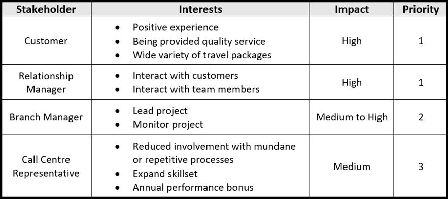

# Title
# Acknowledgements
# Executive Summary
# Contents
1. [Problem Definition](#Problem)
    * 1.1. [Assumptions](#Assumptions)
2. [Business Objectives](#Business)
3. [Stakeholders](#Stakeholders)
    * 3.1. [Empathy Maps](#Empathy)
        * 3.1.1. [Customer](#Empathy--Customer)
        * 3.1.2. [Relationship Manager](#Empathy--RM)
        * 3.1.3. [Branch Manager](#Empathy--BM)
    * 3.2. [POV Statements](#POV)
        * 3.2.1. [Customer](#POV--Customer)
        * 3.2.2. [Relationship Manager](#POV--RM)
        * 3.2.3. [Branch Manager](#POV--BM)
    * 3.3. [HMW Statements](#HMW)
        * 3.3.1. [Customer](#HMW--Customer)
        * 3.3.2. [Relationship Manager](#HMW--RM)
        * 3.3.3. [Branch Manager](#HMW--BM)
4. [Reflection Statement](#Reflection)
5. [Modelling](#Modelling)
    * 5.1. [User Stories](#Modelling--Stories)
    * 5.2. [Use Case Diagrams](#Modelling--UseCase)
    * 5.3. [Activity Diagrams](#Modelling--Activity)
    * 5.4. [Class Diagrams](#Modelling--Class)
    * 5.5. Collaboration or Sequence Diagrams
6. [Analysis](#Analysis)
7. [References](#References)
8. [Appendix](#Appendix)

# 1. Problem Definition 
The business seeks to enhance the operation of their in-house call management centre (CMC) in order to improve the customer experience. Customers often complain about their experience with the relationship manager (RM), describing them as unknowledgeable about their desired travel package and (when being sold products) expressing disinterest in the product being sold, resulting in lost sales. To improve the customer experience and increase profits, the business should implement an automatic call routing system matching customers to an appropriate RM.

## 1.1. Assumptions 
**Current Process**
* Customers are complaining about poor experiences when purchasing travel packages
* Customers are complaining about poor experiences when being sold travel packages
* CMC employees receive calls
* CMC employees transfer customers to RMs
* CMC employees transfer customers to some RMs more than others
* RMs sometimes conduct random sales pitches to many customers in order to meet sales numbers
* Customers are waiting for more than a certain period to get answered by an RM just hang up

**Proposed System**
* Customers create unique profiles according to CMC employee instructions before being transferred to RMs
* CMC employees receive calls when automatic routing is unavailable
* CMC employees receive calls when automatic routing fails to find a suitable RM
* The scripts used for sales pitches are created by the business and stored in a fixed location for the system to access
* Calls that are not answered by RM for a specific package are routed to an automated voicemail system
* Calls received are sorted based on whether customer is an ongoing client or a new Potential client
* A supporting tool to create customer profiles exists, called Profiler Tool.

# 2. Business Objectives 
* Increase response times and reduce abandon rates
* Increase customer satisfaction
* Increase the effectiveness of service recovery programs
* Increase forecast accuracy; customers should not wait to be connected to the correct RM
* Increase the probability of successful sales by intelligently matching customers to travel packages
* Match customers to knowledgable RMs
* Minimise inbound call costs by reducing per-call handling times
* Reduce customer wait times
* Reduce customer effort

# 3. Stakeholders 
Stakeholders for the proposed solution are described in the table below.

## 3.1. Empathy Maps 
### 3.1.1. Customer 

### 3.1.2. Relationship Manager 

### 3.1.3. Branch Manager 

## 3.2. POV Statements 
### 3.2.1. Customer 
The customer interested in a travel package needs to connect with a knowledgable person (RM) because otherwise the customer will obtain incomplete or incorrect information, and have an unsatisfying experience.

### 3.2.2. Relationship Manager 
The relationship manager (RM) needs to receive calls from customers interested in a travel package that the RM specialises in because then they can provide complete and correct information.

The relationship manager needs to spend less time transferring calls to more suitable colleagues because that time is wasted.

### 3.2.3. Branch Manager 
The branch manager needs to improve the customer experience because customers are becoming increasingly dissatisfied with the available services.

## 3.3. HMW Statements 
### 3.3.1. Customer 
* HMW connect customers to a knowledgable RM with an appropriate level of cultural understanding?
* HMW connect customers to a complete and correct source of travel package information?

### 3.3.2. Relationship Manager 
* HMW ensure that RMs receive calls from customers related to their specialised understanding?
* HMW reduce the amount of redundant or unnecessary work performed by RMs?

### 3.3.3. Branch Manager 
* HMW improve the customer experience?
* HMW improve customer satisfaction?
* HMW ensure customers are sold the appropriate travel package?

# 4. Reflection Statement 
The team have conducted interviews with the stakeholders about the current system from their experiences from using the current system. When the team spoke to the customer, they specified that they wanted to speak to the right person that will be able to fulfil their needs, as that appropriate person will be able to match their needs based on the information they provide to that person their speaking with over the phone. The feedback we received from the customer is that the current system has given them a poor experience when purchasing travel packages, also how they are being sold the packages that are available from the travel company is considered to a pain point in their perspective,another thing they mentioned is when they were waiting for more than a certain period of time to speak to the right relationship manager they would just hang up.

# 5. Modelling 
## 5.1. User Stories 
| US001 | Priority | Estimate |
|-------|----------|----------|
| As a Customer, I want to be recommended interesting travel packages so that I learn about new interesting holiday destinations. | M | Medium |
| <b>Acceptance Criteria: </b> Given previous purchases and search history, when contacted by a RM, then travel packages that would reasonably be expected to interest the customer are recommended.

.

| US002 | Priority | Estimate |
|-------|----------|----------|
| As a Customer, I want to be connected with a RM capable of effectively assisting and communicating with me so that I feel like I am being understood. | H | Low |
| <b>Acceptance Criteria: </b> Given ...

.

| US003 | Priority | Estimate |
|-------|----------|----------|
| As a Customer, I want to provide feedback about my experience with an RM so that I feel like I am being understood. | L | Low |
| <b>Acceptance Criteria: </b> Given ...

.

| US004 | Priority | Estimate |
|-------|----------|----------|
| As a Relationship Manager, I want to create a personal profile containing a description of my current skillset so that I can be connected to customers I can effectively assist. | H | Low |
| <b>Acceptance Criteria: </b> Given ...

.

| US005 | Priority | Estimate |
|-------|----------|----------|
| As a Relationship Manager, I want to provide effective service and assistance to customers so that I can improve my sales numbers and sell more holiday packages. | M | Low |
| <b>Acceptance Criteria: </b> Given ...

.

| US006 | Priority | Estimate |
|-------|----------|----------|
| As a Relationship Manager, I want to quickly learn about the new system so that I can quickly return to serving customers and selling packages. | L | Low |
| <b>Acceptance Criteria: </b> Given ...

.

| US007 | Priority | Estimate |
|-------|----------|----------|
| As a Branch Manager, I want to automatically route customers to appropriate RMs so that more sales are successful. | H | High |
| <b>Acceptance Criteria: </b> Given ...

.

| US008 | Priority | Estimate |
|-------|----------|----------|
| As a Branch Manager, I want to automatically route customers to appropriate RMs so that more sales are successful. | H | High |
| <b>Acceptance Criteria: </b> Given ...

.

| US009 | Priority | Estimate |
|-------|----------|----------|
| As a Branch Manager, I want to connect customers with the most effective RM (based on their recent performance) so that the odds of closing each sale is higher. | M | Low |
| <b>Acceptance Criteria: </b> Given ...

.

## 5.2. Use Case Diagrams 
## 5.3. Activity Diagrams 
## 5.4. Class Diagrams 
## 5.5. Collaboration or Sequence Diagrams 

# 6. Analysis 
In the process of developing a new information system to improve the operation of the in house call management cenre (CMC), a number of competitive advantages are gained. The major advantage for the call centre would be improved and smooth operations. Some potential benefits for the call centre include the reduction in inbound call costs by reducing per-call handling time, the ability to carry out more effective and efficient calls, reduction in customer wait times, improved call routing and dynamic call flow control for both inbound and outbound calls, improved customer service, improved RM performance, higher sales of travel packages, increased customer attraction & loyalty, decreased manual labour, reduction in operation/administration expenses, higher profits.
However, whilst there are a number of benefits derived from an upgraded information system, there are also possible adverse effects for the business if its information system project fails.

"Identify and discuss the possible adverse effects for this Business if its information system project fails"
- loss of money, can lost customer base

# References 
# Appendix 
