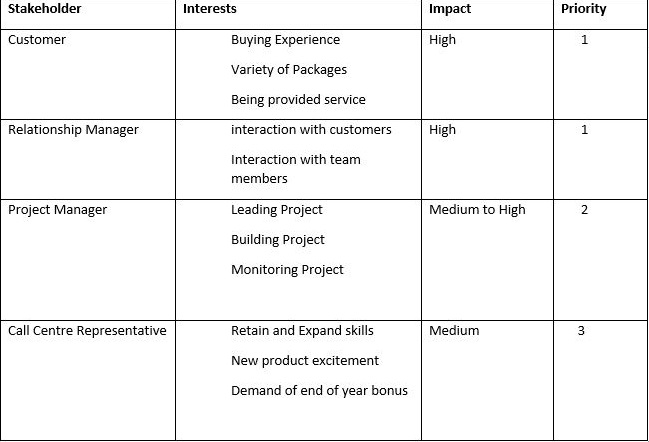
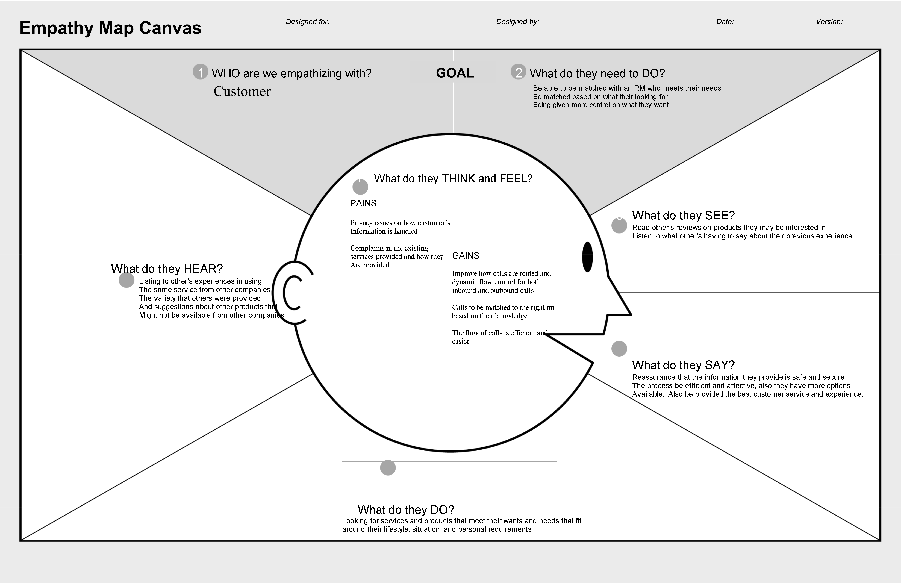

# Title
# Contents
# Acknowledgements
# Executive Summary
Summary of report contents. Should be written after the rest of the report.

# Problem Definition
Define the problem and project objectives.

# Stakeholders

# Design Approach
Describe the AGILE approach (Scrum) used in this project and explain why it was chosen. Outline the Scrum activities used during this project.

# Assumptions
# Proposal

* Workproducts
* Models
* Diagrams

# Analysis
Advantages and disadvantages of the new IT system.

# References
# Appendix
