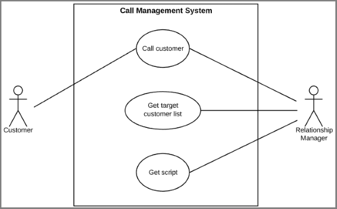
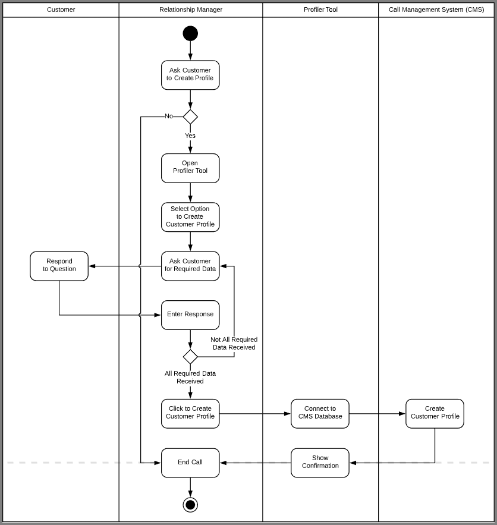
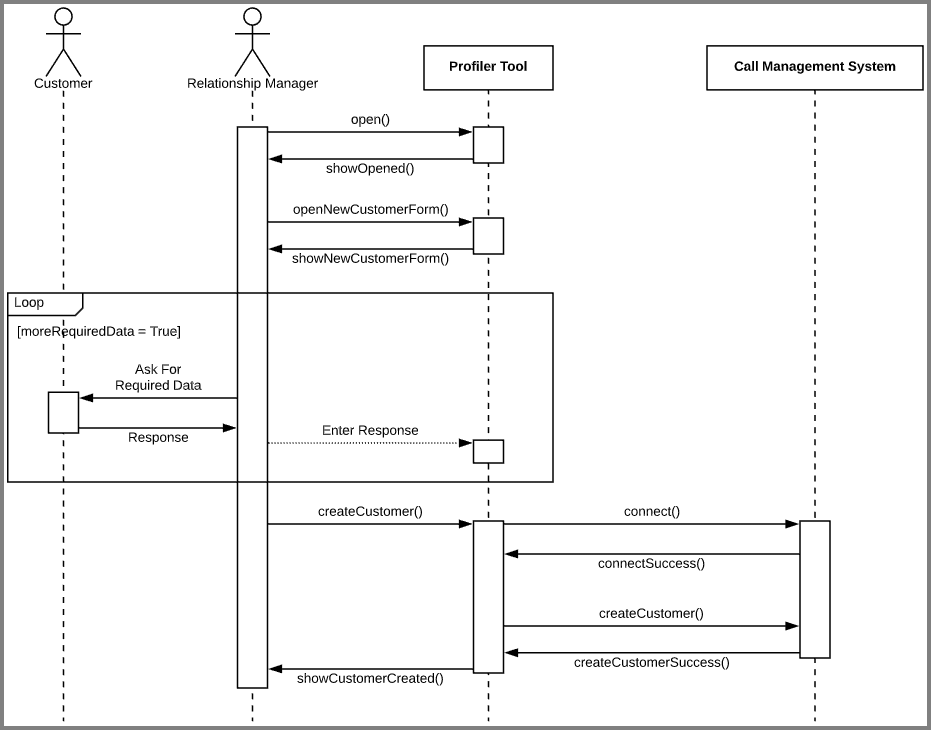

# Title
# Acknowledgements
# Executive Summary
# Contents
1. [Problem Definition](#Problem)
    * 1.1. [Assumptions](#Assumptions)
2. [Business Objectives](#Business)
3. [Stakeholders](#Stakeholders)
    * 3.1. [Empathy Maps](#Empathy)
        * 3.1.1. [Customer](#Empathy--Customer)
        * 3.1.2. [Relationship Manager](#Empathy--RM)
        * 3.1.3. [Branch Manager](#Empathy--BM)
    * 3.2. [POV Statements](#POV)
        * 3.2.1. [Customer](#POV--Customer)
        * 3.2.2. [Relationship Manager](#POV--RM)
        * 3.2.3. [Branch Manager](#POV--BM)
    * 3.3. [HMW Statements](#HMW)
        * 3.3.1. [Customer](#HMW--Customer)
        * 3.3.2. [Relationship Manager](#HMW--RM)
        * 3.3.3. [Branch Manager](#HMW--BM)
4. [Reflection Statement](#Reflection)
5. [Modelling](#Modelling)
    * 5.1. [User Stories](#Modelling--Stories)
    * 5.2. [Use Case Diagrams](#Modelling--UseCase)
    * 5.3. [Use Case Narratives](#Modelling--UseCaseNarratives)
    * 5.4. [Activity Diagrams](#Modelling--Activity)
    * 5.5. [Class Diagram](#Modelling--Class)
    * 5.6. [Sequence Diagrams](#Modelling--Sequence)
6. [Analysis](#Analysis)
7. [References](#References)
8. [Appendix](#Appendix)

# 1. Problem Definition 
The business seeks to enhance the operation of their in-house call management centre (CMC) in order to improve the customer experience. Customers often complain about their experience with the relationship manager (RM), describing them as unknowledgeable about their desired travel package and (when being sold products) expressing disinterest in the product being sold, resulting in lost sales. To improve the customer experience and increase profits, the business should implement an automatic call routing system matching customers to an appropriate RM.

## 1.1. Assumptions 
**Current Process:**
* Customers are complaining about poor experiences when purchasing travel packages
* Customers are complaining about poor experiences when being sold travel packages
* CMC employees receive calls
* CMC employees transfer customers to RMs
* CMC employees transfer customers to some RMs more than others
* RMs sometimes conduct random sales pitches to many customers in order to meet sales numbers
* Customers are waiting for more than a certain period to get answered by an RM just hang up
* Customers are told to call the next day when calling after hours

**Proposed System:**
* Customers create unique profiles according to CMC employee instructions before being transferred to RMs
* CMC employees receive calls when automatic routing is unavailable
* CMC employees receive calls when automatic routing fails to find a suitable RM
* The scripts used for sales pitches are created by the business and stored in a fixed location for the system to access
* Calls that are not answered by RM for a specific package are routed to an automated voicemail system
* Calls received are sorted based on whether customer is an ongoing client or a new Potential client
* A supporting tool to create customer profiles exists, called Profiler Tool.

# 2. Business Objectives 
* Increase response times and reduce abandon rates
* Increase customer satisfaction
* Increase the effectiveness of service recovery programs
* Increase forecast accuracy; customers should not wait to be connected to the correct RM
* Increase the probability of successful sales by intelligently matching customers to travel packages
* Match customers to knowledgable RMs
* Minimise inbound call costs by reducing per-call handling times
* Reduce customer wait times
* Reduce customer effort

# 3. Stakeholders 
Stakeholders for the proposed solution are described in the table below.

## 3.1. Empathy Maps 
### 3.1.1. Customer 

### 3.1.2. Relationship Manager 

### 3.1.3. Branch Manager 

## 3.2. POV Statements 
### 3.2.1. Customer 
The customer interested in a travel package needs to connect with a knowledgable person (RM) because otherwise the customer will obtain incomplete or incorrect information, and have an unsatisfying experience.

### 3.2.2. Relationship Manager 
The relationship manager (RM) needs to receive calls from customers interested in a travel package that the RM specialises in because then they can provide complete and correct information.

The relationship manager needs to spend less time transferring calls to more suitable colleagues because that time is wasted.

### 3.2.3. Branch Manager 
The branch manager needs to improve the customer experience because customers are becoming increasingly dissatisfied with the available services.

## 3.3. HMW Statements 
### 3.3.1. Customer 
* HMW connect customers to a knowledgable RM with an appropriate level of cultural understanding?
* HMW connect customers to a complete and correct source of travel package information?

### 3.3.2. Relationship Manager 
* HMW ensure that RMs receive calls from customers related to their specialised understanding?
* HMW reduce the amount of redundant or unnecessary work performed by RMs?

### 3.3.3. Branch Manager 
* HMW improve the customer experience?
* HMW improve customer satisfaction?
* HMW ensure customers are sold the appropriate travel package?

# 4. Reflection Statement 
The team have conducted interviews with the stakeholders about the current system from their experiences from using the current system. When the team spoke to the customer, they specified that they wanted to speak to the right person that will be able to fulfil their needs, as that appropriate person will be able to match their needs based on the information they provide to that person their speaking with over the phone. The feedback we received from the customer is that the current system has given them a poor experience when purchasing travel packages, also how they are being sold the packages that are available from the travel company is considered to a pain point in their perspective,another thing they mentioned is when they were waiting for more than a certain period of time to speak to the right relationship manager they would just hang up.

# 5. Modelling 
## 5.1. User Stories 
| US001 | Priority | Estimate |
|-------|:--------:|:--------:|
| As a customer, I want to communicate with an employee that understands the product I am searching for so that I can make better purchases. | H | High |
| <b>Acceptance Criteria:</b>  <ul><li>Customer is connected to a RM that understands the desired product</li><li>Customer is connected to a RM that understands contextual knowledge about the product such as cultural traditions</li></ul> |

 

| US002 | Priority | Estimate |
|-------|:--------:|:--------:|
| As a customer, I want to comment on my experience with an employee so that I know my opinion matters to the business. | M | Low |
| <b>Acceptance Criteria:</b>  <ul><li>Customer has the option to rate their experience after each phone call</li><li>Customer has the option to comment on their experience after each phone call</li></ul> |

 

| US003 | Priority | Estimate |
|-------|:--------:|:--------:|
| As a customer, I want to create a personal profile so that I can receive personalised service in the future. | L | Low |
| <b>Acceptance Criteria:</b>  <ul><li>Customer can create a personal profile by communicating with CMC employee</li><li>Customer can update their personal profile at any time</li></ul> |

 

| US004 | Priority | Estimate |
|-------|:--------:|:--------:|
| As a relationship manager, I want to connect with customers that I can provide effective service to so that I can create a strong relationship with the customer. | H | Medium |
| <b>Acceptance Criteria:</b>  <ul><li>RM is connected with customers they are capable of providing effective service to</li></ul> |

 

| US005 | Priority | Estimate |
|-------|:--------:|:--------:|
| As a relationship manager, I want to connect with customers that I can provide effective service to so that I do not need to transfer calls as often. | H | Medium |
| <b>Acceptance Criteria:</b>  <ul><li>RM does not transfer calls as often</li></ul> |

 

| US006 | Priority | Estimate |
|-------|:--------:|:--------:|
| As a relationship manager, I want to quickly find product details so that I can respond to questions in a timely manner. | L | Medium |
| <b>Acceptance Criteria:</b>  <ul><li>RM can search for specific products and product information</li><li>Product information appears within 5 seconds</li><li>Product information is easy to read</li></ul> |

 

| US007 | Priority | Estimate |
|-------|:--------:|:--------:|
| As a relationship manager, I want to sell customers products they are interested in so that I make more sales. | H | High |
| <b>Acceptance Criteria:</b>  <ul><li>System creates product recommendations using purchase history and other customer information that interest the customer</li></ul> |

 

| US008 | Priority | Estimate |
|-------|:--------:|:--------:|
| As a relationship manager, I want to create a personal profile with a description of my skills so that I can be matched with customers I can provide effective service to. | H | Low |
| <b>Acceptance Criteria:</b>  <ul><li>RM can create a personal profile as part of the onboarding process</li><li>RM can update their personal profile at any time</li><li>RM can update their skills at any time</li></ul> |

 

| US009 | Priority | Estimate |
|-------|:--------:|:--------:|
| As a branch manager, I want to put customers in a waiting queue when no RM is available so that customers can connect to available RMs as soon as possible. | M | Medium |
| <b>Acceptance Criteria:</b>  <ul><li>Customers are put in a waiting queue when no RM is available</li><li>Customers are connected with available RMs as soon as the RM becomes available</li><li>Customers are served in order of purchase potential (ties are settled by order of appearance)</li></ul> |

 

| US010 | Priority | Estimate |
|-------|:--------:|:--------:|
| As a branch manager, I want RMs to use a script when selling products so that the customer experience is more consistent and effective. | L | Low |
| <b>Acceptance Criteria:</b>  <ul><li>RM can view product-specific sale scripts when making sales</li></ul> |

## 5.2. Use Case Diagrams 
**Customer:** 

**Relationship Manager:** 

**Profiler Tool:** 

## 5.3. Use Case Narratives 
**US001:** 
[US001 narrative.pdf](https://github.com/ankitasingh263/US001/files/4707574/US001.narrative.pdf)

**US002:** 

**US003:** 

## 5.4. Activity Diagrams 
**US001:** 

**UC002:** 

**US003:** 

## 5.5. Class Diagram 

## 5.6. Sequence Diagrams 
**US001:** 

**UC002:** 

**US003:** 

# 6. Analysis 
The IT solution proposed in this report to improve the operation of the in-house CMC gives the business a competitive edge, compared to similar companies. At present, customers observe a consistent issue with their experiences purchasing products with the business and similar companies: the connected employee is not always capable of providing them with assistance. As a result, customers have the subconscious assumption that this experience cannot be improved. The proposed solution undercuts this assumption, creating a new standard for their interaction with similar companies and, as a result, the business appears to provide better customer service than their competition.

The proposed solution also:
* Automates call flow control
* Reduces the number of delays customers experience in the process
* Reduces the number of employees involved in the process

In reducing the above numbers, the proposed solution reduces costs (reduced call-handling time and administrative costs) and allows employees to work on more value-adding tasks. Also, by streamlining the process, it becomes more suited for further automation.

As described above, the business stands to gain a significant number of customers by being the innovator in customer experience. By not implementing the proposed solution first the business essentially gives up these customers to the competition: the returns from investing into the proposed solution decrease over time, as the risk of competing companies developing similar solutions first increases.

Also, the business has recognised the need to streamline the process and recognised the decreasing quality of their customer experience. The proposed solution is designed to address these concerns, so unless an alternative solution is presented these issues will not be addressed; the customer experience will continue to decline. Considering the scale of the business, it is also possible that some employees will become dissatisfied with their work and leave the business, forcing the business to hire a replacement and introducing more costs. However, it is also possible that some employees will leave the business when they learn their work is being automated.

The business stands to gain a significant number of customers by innovating and implementing the proposed solution before its competitors. In comparison, the negative consequences of implementing the proposed solution are insignificant. It is recommended that the business implements the proposed solution in a timely manner.

# References 
# Appendix 
